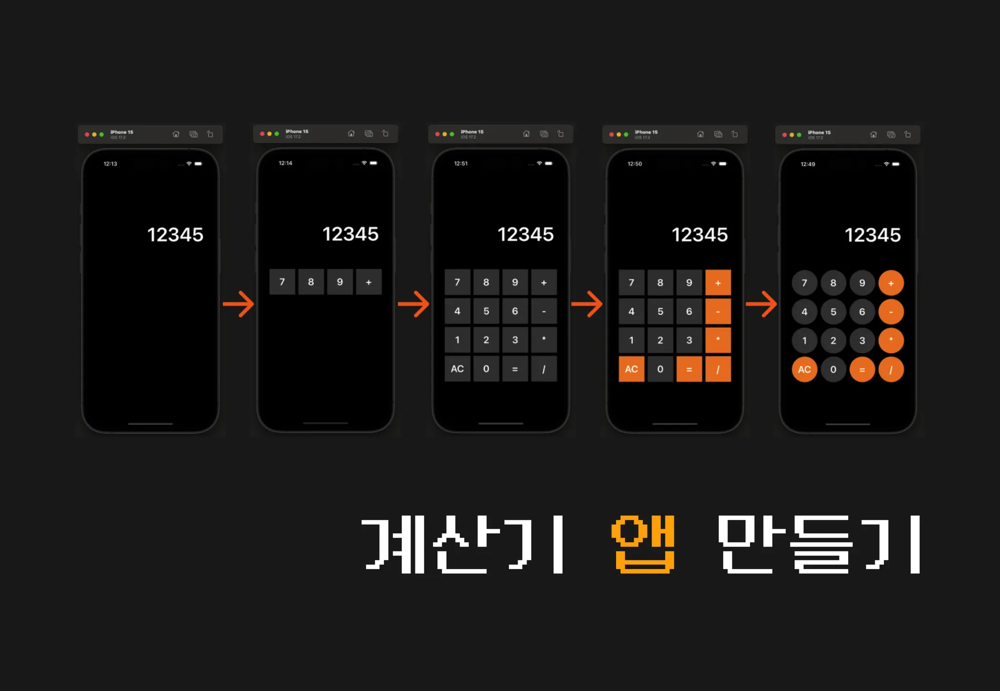
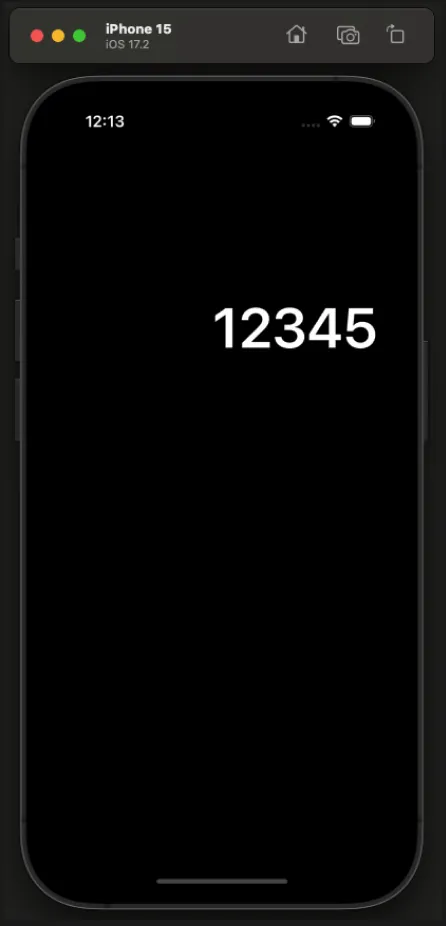
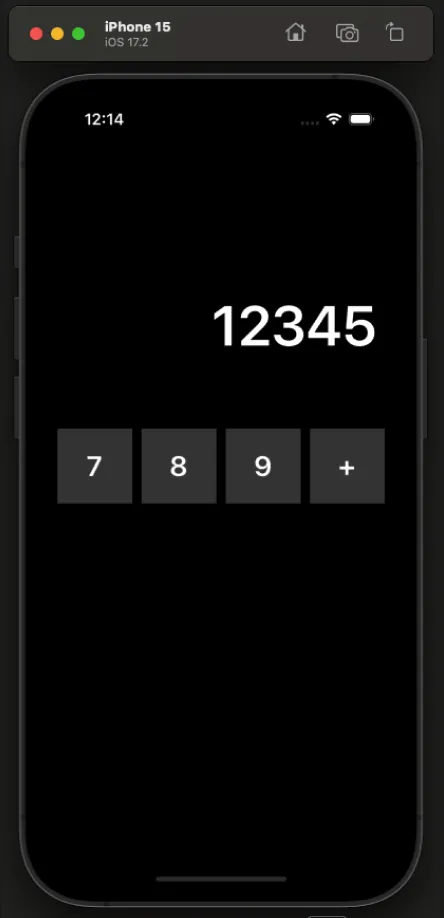
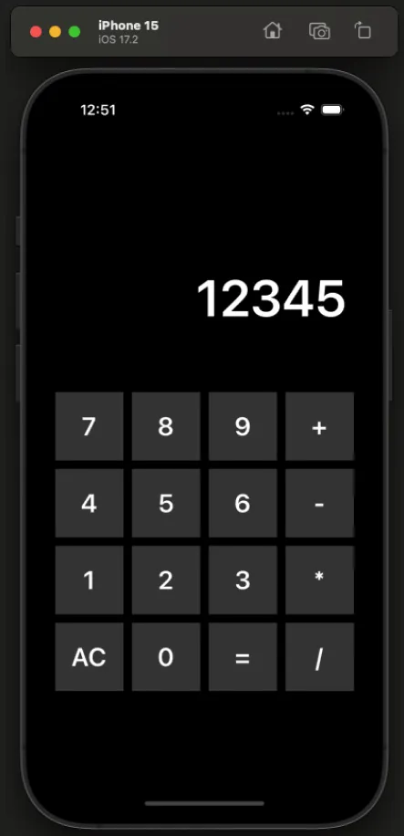
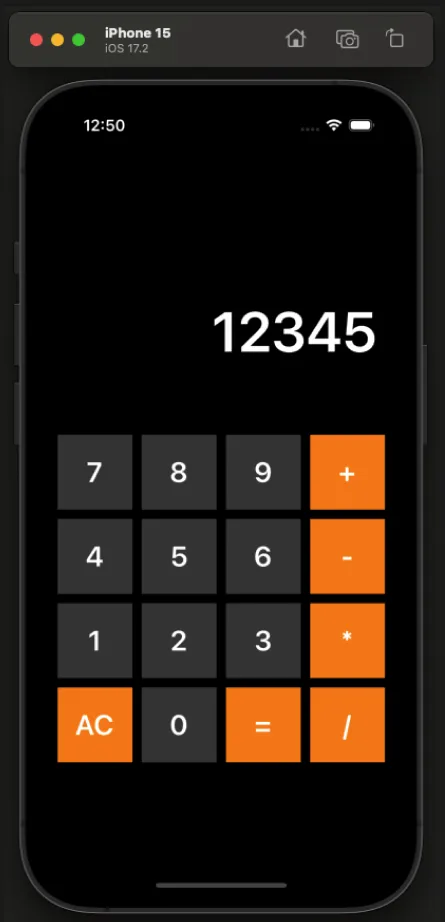
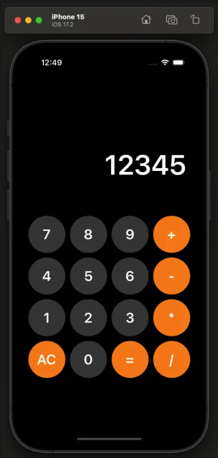
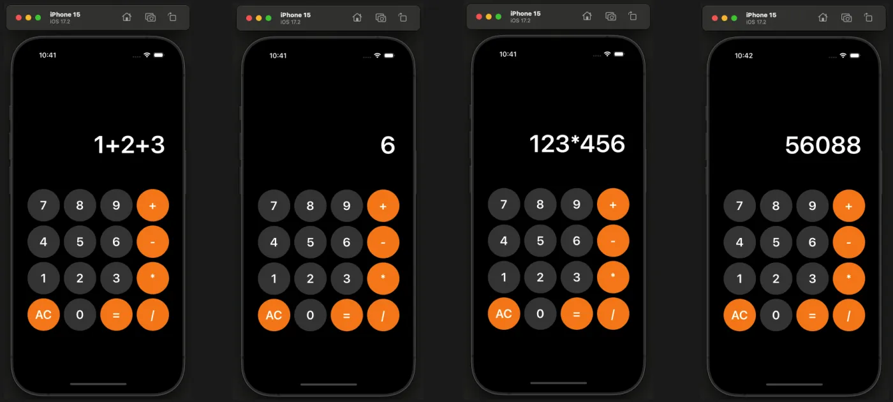

# CalculatorApplication

UIkit을 이용한 codebase 기반 앱 입니다

## 주요기능

1. 숫자와 연산자(+, -, /, *)를 입력하고 = 을 누르면 계산 기능
2. AC를 누르면 0으로 초기화

## 단계별 구현 기능

**LV1.** UILabel 을 사용해서 수식을 표시할 수 있는 라벨을 띄웁니다. 

**LV2.** UIStackView 을 사용해서 4개의 버튼을 모아 가로 스택뷰 생성.

**LV3.** UIStackView 을 사용해서 세로 스택 뷰 생성. 

**LV4.** 연산 버튼 (+, -, *, /, AC, =) 들은 색상을 orange 로 설정.

**LV5.** 모든 버튼들을 원형으로 만들기.

**LV6.** 버튼을 클릭하면 라벨에 표시되도록 합니다.

**LV7.** 초기화 버튼 (AC) 을 구현합니다.

**LV8.** 등호 (=) 버튼을 클릭하면 연산이 수행되도록 구현합니다.
